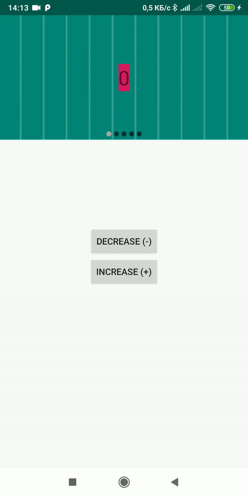

# InfinitePager
[](https://jitpack.io/#popkovanton/InfinitePager)
[](https://www.android.com)
[](https://android-arsenal.com/api?level=14)

## Demo app

[]()

## Download

```groovy
repositories {
        maven { url "https://jitpack.io" }
}

dependencies {
      implementation 'com.github.popkovanton:InfinitePager:$latest_version'
}
```
## Usage
```XML
<com.popkovanton.infinitepagerlib.InfiniteViewPager
        android:id="@+id/infiniteSlider"
        android:layout_width="match_parent"
        android:layout_height="wrap_content"
        app:indicatorRadius="4dp"
        app:autoSlide="true"
        app:indicatorGravity="center_horizontal|bottom"
        app:indicatorMarginHorizontal="5dp"
        app:unselectedColor="@color/colorTabSliderNotActive"
        app:selectedColor="@color/colorTabSliderActive"
        />
```
```groovy
InfiniteViewPager mImageSliderView = findViewById(R.id.infiniteSlider);
SliderAdapter mImageSliderAdapter = new SliderAdapter(getSupportFragmentManager());
mImageSliderView.setAdapter(mImageSliderAdapter);
```
**See sample project for more information**

## XML Attributes
| Attribute Name | Default | Allowed Values |
| --- | --- | --- |
| autoSlide | false | true / false |
| autoSlideDuration | 4000 | any integer (represents ms) |
| isAspectRatio | false | true / false |
| aspectRatio | 0.32 | any float (width / height) |
| indicatorRadius | 3dp | any integer (represents dp) |
| marginBtwIndicators | 4dp | any integer (represents dp) |
| unselectedColor | Color.WHITE | unselected indicator color |
| selectedColor | Color.BLACK | selected indicator color |
| clickable | true | true / false; indicators clickable |
| indicatorGravity | center_horizontal / bottom | top / bottom / left / right / center_vertical / center_horizontal / center / start / end |
| indicatorMarginHorizontal | 10dp |any integer (represents dp) |
| indicatorMarginVertical | 5dp | any integer (represents dp) |
| indicatorVisibility | visible | visible / invisible / gone |